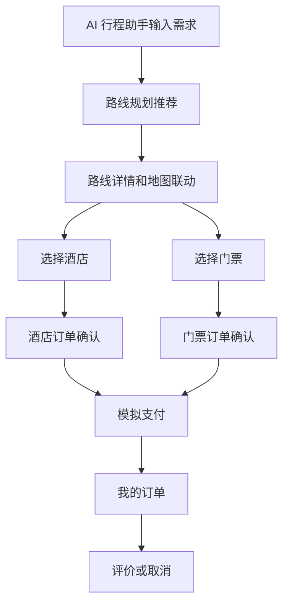

# 智旅旅行系统开发说明

## 5 分钟版

本项目是一个基于 Java SSM 的旅游推荐与预订系统。它围绕“路线规划、酒店预订、景点门票、订单管理、AI 问答、地图展示、后台管理”形成完整业务闭环。

你本机可以直接双击：

```bat
F:\tourism-system\run-local.bat
```

脚本会自动打包、部署到 Tomcat，并打开系统首页。

## 1. 项目定位

项目面向普通游客和后台管理员两类角色。

普通游客完成路线推荐、酒店预订、门票预订、订单支付、评价和 AI 咨询。管理员维护景点、酒店、门票、路线和订单。

## 2. 技术架构

| 层级 | 技术 |
| --- | --- |
| 后端框架 | Spring、Spring MVC、MyBatis |
| 前端页面 | JSP、HTML、CSS、JavaScript |
| 数据库 | MySQL |
| 地图服务 | 高德地图 Web JavaScript API |
| AI 问答 | 本地 RAG 检索，预留 OpenAI 兼容接口 |
| 运行容器 | Tomcat 9 |
| 构建工具 | Maven |

## 3. 快速运行

`run-local.bat` 会自动完成：

1. 设置 JDK、Tomcat、数据库和 AI 环境变量。
2. 执行 `mvn clean package -DskipTests`。
3. 清理 Tomcat 旧部署。
4. 部署新的 `tourism-system.war`。
5. 启动 Tomcat 并打开浏览器。

给别人或上传 GitHub 时，只提交 `run-local.example.bat`。不要提交 `run-local.bat`。

## 4. 核心模块

| 模块 | 说明 |
| --- | --- |
| 用户认证 | 登录、注册、退出、角色分流 |
| 路线规划 | 按城市、预算、天数、兴趣推荐路线 |
| 酒店预订 | 酒店列表、房型查询、房态互斥、下单 |
| 门票活动 | 景点查询、票种查询、库存预减、下单 |
| 我的订单 | 酒店订单和门票订单统一展示，支持支付和取消 |
| 旅游地图 | 展示景点、酒店、美食、机场、火车站，支持路线联动 |
| AI 行程助手 | 左侧需求输入，右侧智能答复和 RAG 来源 |
| 后台管理 | 景点、酒店、门票、路线、订单分页管理 |

## 5. 业务流程



## 6. 配置外置

`application.properties` 优先读取环境变量。

| 环境变量 | 作用 |
| --- | --- |
| `DB_URL` | 数据库连接地址 |
| `DB_USERNAME` | 数据库用户名 |
| `DB_PASSWORD` | 数据库密码 |
| `AI_API_ENABLED` | 是否启用外部大模型 |
| `AI_API_URL` | 大模型接口地址 |
| `AI_API_MODEL` | 大模型名称 |
| `AI_API_KEY` | 大模型密钥 |

## 7. GitHub 安全策略

| 文件 | 处理方式 |
| --- | --- |
| `run-local.bat` | 本机使用，已被 `.gitignore` 忽略 |
| `run-local.example.bat` | 示例脚本，可以提交 |
| `target/` | 构建产物，不提交 |
| `amap-config.js` | 默认不写真实 Key |
| 大模型 Key | 只通过环境变量注入 |

## 8. 最近修复

1. 后台管理改为模块切换和分页展示。
2. 我的订单页修复数组响应解析，新订单可立即展示。
3. 地图页统一携程式左栏和顶栏。
4. 地图页支持路线规划点位联动。
5. 首页、路线、酒店、门票、AI 模块统一中文界面。
6. 高德 Key 从 `map.jsp` 移出，避免上传 GitHub 泄露。

## 9. 默认账号

| 角色 | 账号 | 密码 |
| --- | --- | --- |
| 普通用户 | `demo` | `demo123` |
| 管理员 | `admin` | `admin123` |

## 10. 页面入口

| 页面 | 地址 |
| --- | --- |
| 入口页 | `/index.jsp` |
| 登录页 | `/login.jsp` |
| 首页 | `/home.jsp` |
| 路线规划 | `/routes.jsp` |
| 酒店预订 | `/hotels.jsp` |
| 门票活动 | `/tickets.jsp` |
| 旅游地图 | `/map.jsp` |
| AI 行程助手 | `/ai.jsp` |
| 我的订单 | `/orders.jsp` |
| 后台管理 | `/admin.jsp` |
