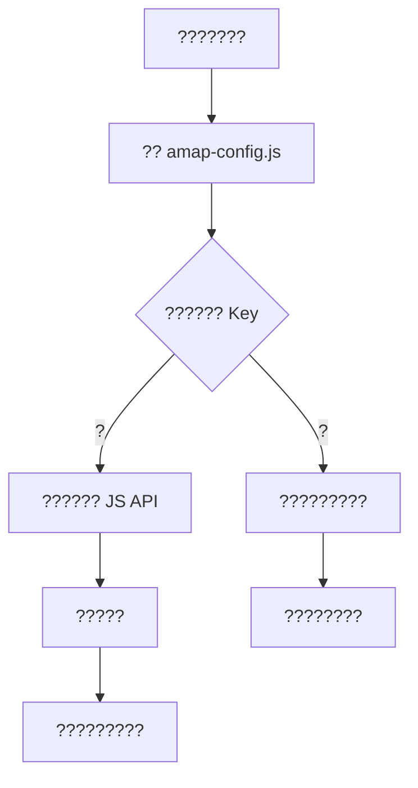

# ????????

## 5 ???

???????????????? Key ???? `map.jsp`?

???????

```text
src/main/webapp/static/js/amap-config.js
```

???

```javascript
window.TOURISM_AMAP_CONFIG = {
    key: "????Key",
    securityJsCode: "??????"
};
```

??????

```text
http://localhost:8080/tourism-system/map.jsp
```

## ???????

?? Key ???????????????????? JSP ?????????? GitHub?

???????

1. `map.jsp` ??? `amap-config.js`?
2. `amap-config.js` ?????
3. ?????????? Key?
4. ?? Key ?????????????????????

## ????



## ????

| ?? | ?? |
| --- | --- |
| `src/main/webapp/map.jsp` | ??????????????? |
| `src/main/webapp/static/js/amap-config.js` | ?? Key ??????? |
| `src/main/resources/sql/init.sql` | ????????? |

## ????

> ??????? Key???? Key????????? GitHub?

?????????????????

```javascript
window.TOURISM_AMAP_CONFIG = {
    key: "",
    securityJsCode: ""
};
```
