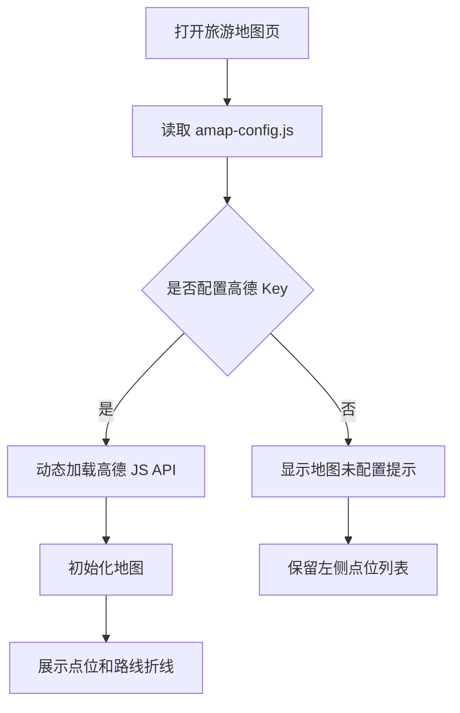

# 高德地图接入说明

## 5 分钟版

地图页已经改成安全配置模式。真实 Key 不再写进 `map.jsp`。

你只需要打开：

```text
src/main/webapp/static/js/amap-config.js
```

填入：

```javascript
window.TOURISM_AMAP_CONFIG = {
    key: "你的高德Key",
    securityJsCode: "你的安全密钥"
};
```

配置后访问：

```text
http://localhost:8080/tourism-system/map.jsp
```

## 为什么要这样做

高德 Key 和安全密钥属于敏感配置。它们不能直接写在 JSP 页面里，也不适合上传 GitHub。

现在的做法是：

1. `map.jsp` 只读取 `amap-config.js`。
2. `amap-config.js` 默认留空。
3. 本机演示时再填自己的 Key。
4. 没有 Key 时，页面显示兜底提示，点位列表仍然能展示。

## 加载流程



## 相关文件

| 文件 | 作用 |
| --- | --- |
| `src/main/webapp/map.jsp` | 旅游地图页面，动态加载高德地图 |
| `src/main/webapp/static/js/amap-config.js` | 高德 Key 和安全密钥配置 |
| `src/main/resources/sql/init.sql` | 初始化地图点位数据 |

## 注意事项

> 不要把真实高德 Key、大模型 Key、数据库密码提交到 GitHub。

如果你想提交模板，可以提交空配置：

```javascript
window.TOURISM_AMAP_CONFIG = {
    key: "",
    securityJsCode: ""
};
```
